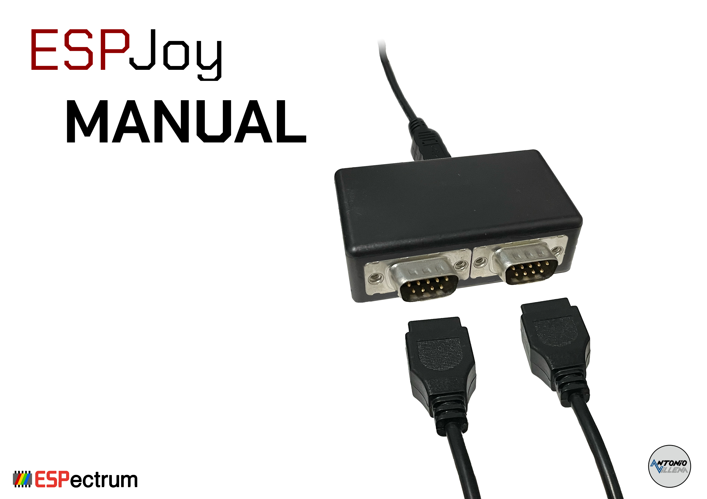

= ESPjoy English Manual
:author: kounch
:revnumber: 1.0.0
:doctype: book
:notitle:
:front-cover-image: 
:email: kounch@users.noreply.github.com
:Revision: 1.0
:description: ESPjoy English Manual
:keywords: Manual, English, ESPjoy
:icons: font
:source-highlighter: rouge
:toc: left
:toc-title: Index
:toclevels: 4

<<<

== Introduction

include::espjoy_en.adoc[]

== References

https://antoniovillena.com/product/espjoy/

http://github.com/Dacarsoft/DB9_2_Keyboard

https://github.com/MickGyver/DaemonBite-Retro-Controllers-USB/tree/master/SegaTwoControllersUSB

https://avrdude.readthedocs.io/en/latest/

https://stackoverflow.com/questions/45646127/how-to-upload-a-hex-file-into-an-arduino-leonardo-using-avrdude-from-the-command

