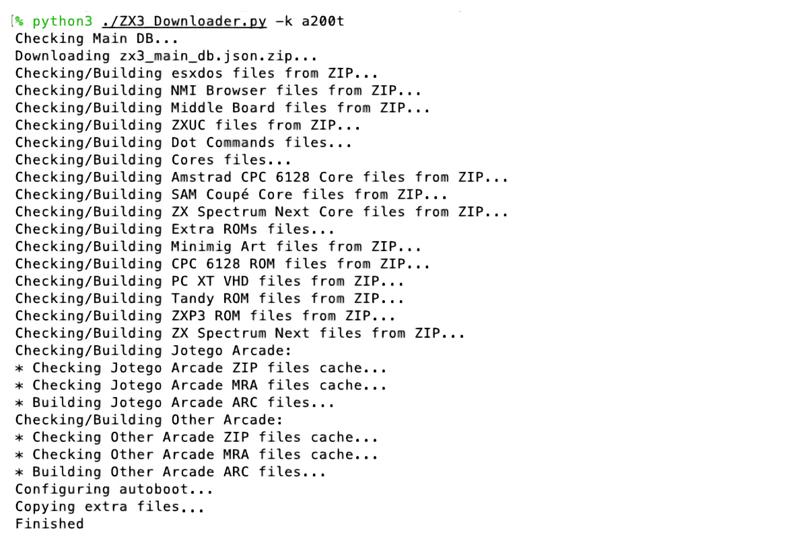
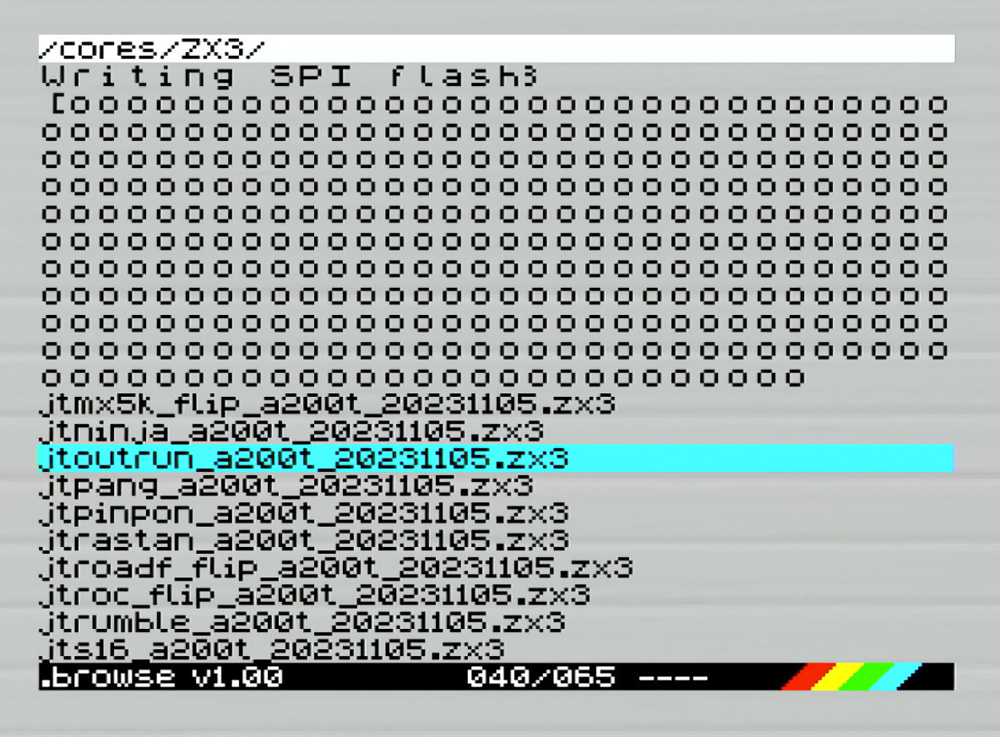

= ZXTRES, ZXTRES+ y ZXTRES++ - Guía Rápida
:author: kounch
:revnumber: 1.0.0
:doctype: book
:docinfo: shared
:notitle:
:email: kounch@users.noreply.github.com
:Revision: 1.0
:description: ZXTRES Guía Rápida
:keywords: Manual, Rápido, Castellano, ZXTRES, ZXTRES+. ZXTRES++
:icons: font
:source-highlighter: rouge
:version-label: Versión
:last-update-label: Última actualización

<<<

== Puertos y conectores

Bienvenido a la https://github.com/zxtres/[familia ZXTRES] de dispositivos FPGA. Esta guía explica los primeros pasos a realizar para poder utilizar su dispositivo ZXTRES, ZXTRES+ o ZXTRES++.

[.text-left]

[.text-right]

<<<

== Primer arranque

Para poder poner en marcha un ZXTRES hace falta, al menos, lo siguiente:

- Una TV u otro dispositivo que ofrezca alimentación USB (5VDC y, al menos, 1A). El conector es un jack de barril de 5,5mm en el exterior y 2,1mm en el interior, con polaridad positiva (el exterior positivo y el interior negativo)
- Un cable y un monitor o TV con DisplayPort, VGA o RGB (la conexión RGB también se puede utilizar con un adaptador VGA a SCART y conectarse a TV compatibles)
- Un teclado PS/2

[.text-center]
image:img/QuickStartGuide3.png[scaledwidth=60%]

Antes de comenzar asegúrese de que, al menos, ha conectado el cable de alimentación, un cable de vídeo conectado a un monitor o televisión compatible, y un teclado PS/2.

Pulse el interruptor y compruebe en la pantalla que el sistema inicia correctamente.

[.text-center]
image:img/boot_zxtres.png[scaledwidth=50%]

<<<

== Tarjeta microSD

Asegúrese de que la tarjeta microSD que desea utilizar está con formato FAT32. De no ser así se puede utilizar https://www.sdcard.org/downloads/formatter/[la herramienta oficial de la SD Association].

Con el programa https://github.com/kounch/ZX3_Downloader[ZX3 Downloader] se puede preparar una tarjeta microSD básica para usar con el ZXTRES. La última versión se puede descargar desde aquí:

https://github.com/kounch/ZX3_Downloader/releases/latest

Copiar el fichero `ZX3_Downloader…` en un directorio con suficiente espacio disponible (al menos, 4,5GB, si se usan las opciones por defecto), y ejecutarlo, indicando el tipo de FPGA según el modelo (`a35t` para ZXTRES, `a100t` para ZXTRES+ o `a200t` para ZXTRES++).

Por ejemplo, para ZXTRES, en Windows:

[source,shell]
----
...ZX3_Downloader.exe -k a35t
----

Lo mismo, pero para ZXTRES+:

[source,shell]
----
...ZX3_Downloader.exe -k a100t
----

O para ZXTRES++:

[source,shell]
----
...ZX3_Downloader.exe -k a200t
----

<<<

Esperar durante varios minutos, hasta que se realice la descarga de todo lo necesario y se cree el contenido.

[.text-center]

Una vez el proceso haya finalizado, si no se han producido errores, copiar el contenido del directorio `SD` que se habrá creado, a la raíz de la tarjeta microSD.

[.text-center]
image:img/sd_zxtres.png[scaledwidth=55%]

Si se produjera alguna situación que interrumpa la descarga de ficheros, se recomienda volver a lanzar la utilidad, que continuará a partir de ese último fallo.

<<<

Asegúrese de que el ZXTRES esté apagado. Inserte la tarjeta microSD y pulse de nuevo el interruptor de encendido.

[.text-center]
image:img/QuickStartGuide4.png[scaledwidth=70%]

Ahora se iniciará de nuevo la FPGA con el core por defecto de ZX Spectrum, pero esta vez, activando el https://spectrumcomputing.co.uk/forums/viewtopic.php?t=2553[navegador NMI de Bob Fossil] y accediendo al directorio de la microSD donde están los ficheros de core.

[.text-center]
image:img/QuickStartGuide5.png[scaledwidth=55%]

<<<

Utilizar las teclas de cursor para desplazarse por la lista, y pulsar `Enter` para cargar el core deseado. Notar que los ficheros de core `.bit` sólo se pueden usar en ZXTRES que dispongan de una tarjeta intermedia. Los ficheros de core `.zx3` se pueden usar siempre.

[.text-center]

Tras unos segundos, el core deseado se activará en la FPGA y se podrá utilizar.

[.text-center]
image:img/QuickStartGuide7.png[scaledwidth=60%]

<<<

== Preguntas frecuentes

=== No hay imagen al encender la FPGA o al cargar algunos cores

En el caso del core ZX Spectrum por defecto, pulsar la tecla `Bloq. Despl.` que cambia de modo vídeo RGB a VGA y viceversa (DisplayPort está siempre activo).

Consultar el https://zxtres.github.io/wiki/manual_es.html#_introducción[manual completo de ZXTRES] para información más detallada sobre los modos de vídeo que soporta cada core y la forma de activarlos.

=== El sonido se oye distorsionado o no hay ningún sonido

Comprobar que la salida de sonido está correctamente conectada. También, según el core que se esté utilizando, se puede probar a cambiar el interruptor en la base del ZXTRES entre https://es.wikipedia.org/wiki/I²S[I^2^S] o https://es.wikipedia.org/wiki/Modulación_Sigma-Delta[Sigma-Delta].

[.text-center]
image:img/ZXTRESbottom.jpg[scaledwidth=60%]

=== Aparece un borde rojo parpadeante en el navegador NMI

Algunos dispositivos conectados a los puertos de los mandos pueden tener problemas de compatibilidad con el navegador NMI. Esto se puede solucionar desactivando el joystick Kempston en su configuración o, a veces, __conectando un mando a la vez al segundo puerto__.

Consultar el https://zxtres.github.io/wiki/manual_es.html#_introducción[manual completo de ZXTRES] para más información.

=== El teclado no funciona correctamente 

Es importante que la fuente tenga un voltaje estable y suficiente intensidad, o es posible que ocurran comportamientos erráticos (fallo del teclado, DisplayPort, etc.). Algunos teclados y periféricos podrían requerir el uso de una fuente de alimentación que ofrezca 2 amperios o más.

=== Los ficheros de core se ven duplicados en el navegador

Si la tarjeta microSD se ha preparado con macOS, pueden aparecer ficheros extra cuyo nombre comienza con `._`. Esto es porque macOS indexa y guarda información extra en archivos de los discos externos. Estos se puede limpiar usando estos comandos de Terminal (suponiendo que la partición de la microSD se llame `ZXTRES`):

[source,shell]
----
cd /Volumes/ZXTRES
dot_clean . -n && find . -name ".DS*" -exec rm {} \;
cd -
----
