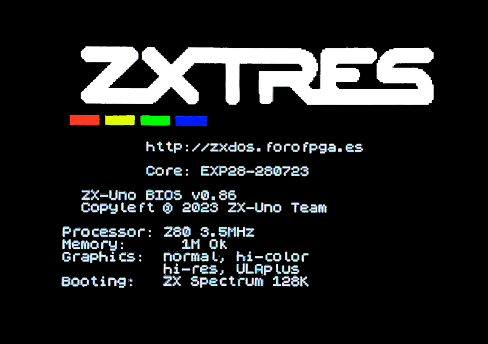

= ZXTRES, ZXTRES+ and ZXTRES++ - Quick Start Guide
:author: kounch
:revnumber: 1.0.0
:doctype: book
:docinfo: shared
:notitle:
:email: kounch@users.noreply.github.com
:Revision: 1.0
:description: ZXTRES Quick Start Guide
:keywords: Manual, Quick, English, ZXTRES, ZXTRES+. ZXTRES++
:icons: font
:source-highlighter: rouge
:version-label: Version
:last-update-label: Last Update

<<<

== Ports and connectors

Welcome to the https://github.com/zxtres/[ZXTRES family] of FPGA devices. This guide explains the first steps to take when using a ZXTRES, ZXTRES+ o ZXTRES++ device.

[.text-left]

[.text-right]

<<<

== First boot

To set up and use the ZXTRES you need at least:

- DisplayPort, VGA or RGB cable and compatible display (the RGB connection can also be used with a VGA to SCART adapter and connected to compatible TVs).
- PS/2 keyboard
- USB charger, TV or other device that provides USB power (5VDC and at least 1A). The connector is a coaxial jack "barrel" plug of 5.5mm outer diameter and 2.1mm inner diameter with positive polarity (centre positive)

[.text-center]
image:img/QuickStartGuide3.png[scaledwidth=60%]

Make sure that, at least, the power cable is connected, a video cable is also connected to a display, and a PS/2 keyboard is attached.

Turn the power switch on and check, looking at the display, that the system boots correctly.

[.text-center]

<<<

== MicroSD card

Make sure that the microSD card you want to use is in FAT32 format. Otherwise, you can use https://www.sdcard.org/downloads/formatter/[the official formatting tool of the SD Association].

With the https://github.com/kounch/ZX3_Downloader[ZX3 Downloader] tool you can prepare a basic microSD card to use with ZXTRES. The latest version can be downloaded from here:

https://github.com/kounch/ZX3_Downloader/releases/latest

Copy the `ZX3_Downloader…` file to a directory with enough free space (4.5GB, at least, if using the default options), and execute it, stating the kind of FPGA depending on the model (`a35t` for ZXTRES, `a100t` for ZXTRES+ or `a200t` for ZXTRES++).

For example, for ZXTRES, on Windows:

[source,shell]
----
...ZX3_Downloader.exe -k a35t
----

The same, but for ZXTRES+:

[source,shell]
----
...ZX3_Downloader.exe -k a100t
----

Or ZXTRES++:

[source,shell]
----
...ZX3_Downloader.exe -k a200t
----

<<<

Wait a few minutes, while all the content is downloaded and built.

[.text-center]
image:img/zx3downloader.png[scaledwidth=50%]

Once the process finishes, if no errors appear, copy the content from the newly created `SD` directory to the root of the microSD card.

[.text-center]

If the download process was interrupted, it's recommended to start again the tool, which will continue since the last failed file.

<<<

Make sure that the ZXTRES is turned off. Insert the microSD card and turn on again the power switch.

[.text-center]
image:img/QuickStartGuide4.png[scaledwidth=70%]

Now the FPGA will boot again with the default ZX Spectrum core, but this time, running https://spectrumcomputing.co.uk/forums/viewtopic.php?t=2553[Bob Fossil's NMI Browser] and navigating automatically the microSD directory where all the core files are.

[.text-center]

<<<

Use the cursor keys to move through the list, and press `Enter` to load the desired core. Please note that `.bit` core files can only be used with a ZXTRES with a middle board installed, while `.zx3` core files can always be used.

[.text-center]
image:img/QuickStartGuide6.png[scaledwidth=55%]

After a few seconds, the desired core will activate in the FPGA, ready to use.

[.text-center]
image:img/QuickStartGuide7.png[scaledwidth=60%]

<<<

== Frequently asked questions

=== No image when the FPGA is powered on or when loading some cores

If using default ZX Spectrum core, press the `Scroll Lock` key, which switches between RGB and VGA video modes (DisplayPort is always enabled).

See the https://zxtres.github.io/wiki/manual_en.html#_introduction[full ZXTRES manual] for more detailed information about which video modes each core supports and how to activate them.

=== Sound is distorted or there's no sound at all

Check that the audio output is correctly connected. Also, depending on the current core, you may change the sound selection switch position (in the bottom of the ZXTRES) between https://en.wikipedia.org/wiki/I²S[I^2^S] or https://en.wikipedia.org/wiki/Delta-sigma_modulation[Sigma-Delta].

[.text-center]
image:img/ZXTRESbottom.jpg[scaledwidth=60%]

=== The NMI browser shows a flashing red border

Some devices, when connected to the joystick ports, may cause a flashing red border when starting the browser. This may be solved by disabling the Kempston joystick in your configuration or, sometimes, __connecting simultaneously a controller to the second port__.

See the https://zxtres.github.io/wiki/manual_en.html#_introduction[full ZXTRES manual] for more detailed information.

<<<

=== The keyboard does not work correctly

It's important that the source has stable voltage and sufficient current or erratic behaviour may occur (the keyboard or DisplayPort may fail and so on). Some keyboards or peripherals may require a similar power supply but with 2A or more.

=== Core files are shown duplicated in the browser

If the microSD card has been built using macOS, extra files with a name starting with `._` may appear. This is because macOS index and stores extra information in external disk files. You can clean up them using these Terminal commands (assuming that the SD partition is called `ZXTRES`):

[source,shell]
----
cd /Volumes/ZXTRES
dot_clean . -n && find . -name ".DS*" -exec rm {} \;
cd -
----
