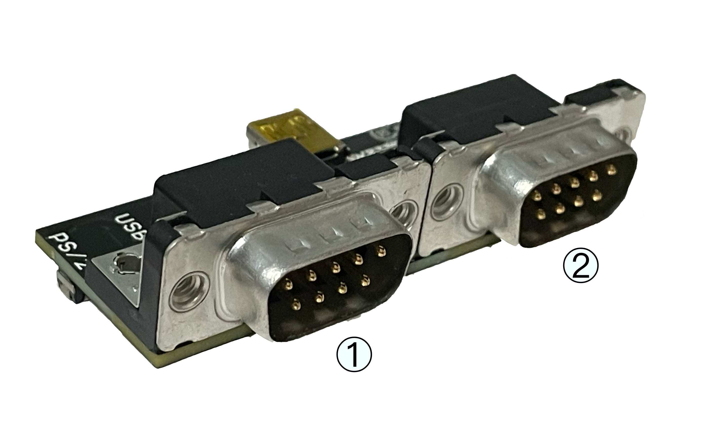
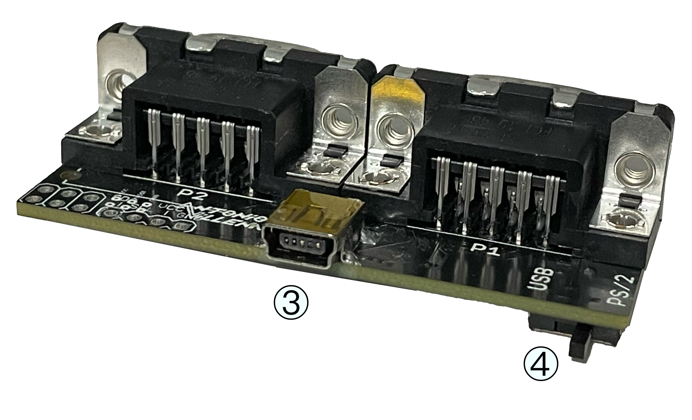
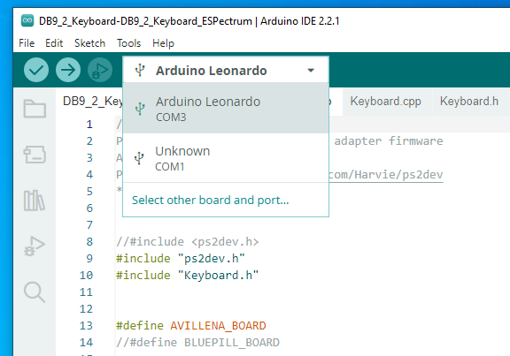
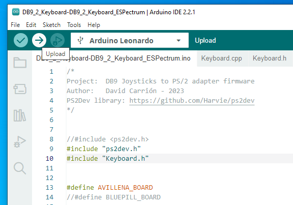
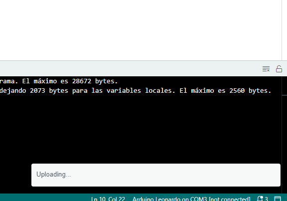
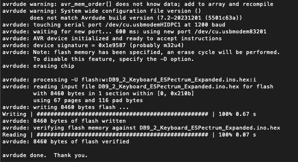

https://antoniovillena.com/product/espjoy/[ESPjoy] is an adapter board with https://en.wikipedia.org/wiki/D-sub[DE-9] ports for https://en.wikipedia.org/wiki/Atari_joystick_port[Atari standard] or https://en.wikipedia.org/wiki/Sega_Genesis[Sega Genesis (Mega Drive)] controllers that converts their button presses to equivalent keyboard press signals.

It is originally designed to use with https://zxespectrum.speccy.org[ESPectrum], but can be used with other devices, as it is able to convert to two different keyboard protocols (USB and PS/2), with a built-in switch for selection.

This keyboard translation is very useful for emulators or for FPGA-based devices, such as the https://zxuno.speccy.org[ZX-Uno] family and its derivatives or https://github.com/MiSTer-devel/Wiki_MiSTer/wiki[MiSTer], that do not have support for joystick connectors. For example, for computer cores when not using a permanently connected keyboard.

The on-board firmware sends keystrokes when a button of any connected controller is pressed and can use two controllers simultaneously.

One or two-button (Atari standard) controllers and joysticks are supported, as well as three or 6-button Sega controllers.

<<<

== Buttons and ports

[width="100%",cols="2a,3a",frame="none"]
|===
|[cols="1,4"]
!===
!1 !First DE-9 Port
!2 !Second DE-9 Port
!===
|
|===

[width="100%",cols="3a,2a",frame="none"]
|===
| 
|[cols="1,4"]
!===
!3 !USB Mini-B Port
!4 !Protocol selection switch
!===
|===

<<<

== Use

=== Configuration

To use with ESPectrum, the PS/2 option on the switch hast to be selected. The USB option can be used with MiSTer or another compatible system (PC, Mac, etc.). With the original firmware designed by David Carrión a HID keyboard is emulated, so it can be used without problem in MiSTer with computer cores.

Connection detection is performed in the first seconds after boot when the board is connected to a USB or PS/2 port is receiving power. If the board is connected to a device such as a PC or similar while starting up, it is very likely that the USB detection will fail, because the operating system is not yet ready when the board detection timeout is reached. In that case, it has to be disconnected and reconnected once the PC device is ready to detect the connection.

[TIP]
====
The PS/2 or USB mode selection switch hast to be set before connecting the board to power, or it will not function properly.
====

=== Keymap selection

On startup, by pressing and holding any of the specified buttons, according to the tables below, you can select one of the different keyboard translations.

[NOTE]
====
The default assignment behavior (when no button is pressed at startup) varies depending on the firmware you have installed on the ESPJoy. When the option (Original) is specified, we are talking about the firmware not adapted for ESPectrum. In the other case (ESPectrum), it's about ESPectrum adapted firmware.
====

[WARNING]
====
The default assignment on ESPectrum firmware, when using the PS/2, port makes it incompatible with standard PS/2 devices. Therefore, in that case, you have to press a button which activates a different keyboard configuration during startup.
====

[WARNING]
====
There are some clone controllers that can send strange signals in some directions. Because of this, the startup check in the code may fail, and the activation at startup, e.g. when pressing left on the keyboard, could not work properly. 
====

<<<

*Port 1 (PS/2)*

[align="center",width="100%",%header,cols="2a,1a,1a,1a,1a,1a,1a,1a,1a,1a,1a,1a,1a",options="header"]
|===
|[.tiny]#Press on Start#|[.tiny]#Up#|[.tiny]#Down#|[.tiny]#Left#|[.tiny]#Right#|[.tiny]#A#|[.tiny]#B#|[.tiny]#C#|[.tiny]#Start#|[.tiny]#X#|[.tiny]#Y#|[.tiny]#Z#|[.tiny]#Mode#
|[.tiny]#None (Original)#|[.tiny]#Up#|[.tiny]#Down#|[.tiny]#Left#|[.tiny]#Right#|[.tiny]#Escape#|[.tiny]#Enter#|[.tiny]#Right Alt#|[.tiny]#F1#|[.tiny]#X#|[.tiny]#Y#|[.tiny]#Z#|[.tiny]#M#
|[.tiny]#None (ESPectrum)#|[.tiny]#Up#|[.tiny]#Down#|[.tiny]#Left#|[.tiny]#Right#|[.tiny]#A#|[.tiny]#B#|[.tiny]#C#|[.tiny]#Start#|[.tiny]#X#|[.tiny]#Y#|[.tiny]#Z#|[.tiny]#Mode#
|[.tiny]#Up#|[.tiny]#Q#|[.tiny]#A#|[.tiny]#O#|[.tiny]#P#|[.tiny]#Escape#|[.tiny]#M#|[.tiny]#Enter#|[.tiny]#F1#|[.tiny]#X#|[.tiny]#Y#|[.tiny]#Z#|[.tiny]#C#
|[.tiny]#Down#|[.tiny]#Up#|[.tiny]#Down#|[.tiny]#Left#|[.tiny]#Right#|[.tiny]#Escape#|[.tiny]#Enter#|[.tiny]#`0`#|[.tiny]#F5#|[.tiny]#X#|[.tiny]#Y#|[.tiny]#Z#|[.tiny]#M#
|[.tiny]#Left#|[.tiny]#7#|[.tiny]#6#|[.tiny]#5#|[.tiny]#8#|[.tiny]#Escape#|[.tiny]#`0`#|[.tiny]#Enter#|[.tiny]#F1#|[.tiny]#X#|[.tiny]#Y#|[.tiny]#Z#|[.tiny]#M#
|===

*Port 2 (PS/2)*

[align="center",width="100%",%header,cols="2a,1a,1a,1a,1a,1a,1a,1a,1a,1a,1a,1a,1a",options="header"]
|===
|[.tiny]#Press on Start#|[.tiny]#Up#|[.tiny]#Down#|[.tiny]#Left#|[.tiny]#Right#|[.tiny]#A#|[.tiny]#B#|[.tiny]#C#|[.tiny]#Start#|[.tiny]#X#|[.tiny]#Y#|[.tiny]#Z#|[.tiny]#Mode#
|[.tiny]#None (Original)#|[.tiny]#Q#|[.tiny]#A#|[.tiny]#O#|[.tiny]#P#|[.tiny]#Escape#|[.tiny]#M#|[.tiny]#Enter#|[.tiny]#F1#|[.tiny]#X#|[.tiny]#Y#|[.tiny]#Z#|[.tiny]#C#
|[.tiny]#None (ESPectrum)#|[.tiny]#Up#|[.tiny]#Down#|[.tiny]#Left#|[.tiny]#Right#|[.tiny]#A#|[.tiny]#B#|[.tiny]#C#|[.tiny]#Start#|[.tiny]#X#|[.tiny]#Y#|[.tiny]#Z#|[.tiny]#Mode#
|[.tiny]#Up#|[.tiny]#Up#|[.tiny]#Down#|[.tiny]#Left#|[.tiny]#Right#|[.tiny]#Escape#|[.tiny]#Enter#|[.tiny]#Right Alt#|[.tiny]#F1#|[.tiny]#X#|[.tiny]#Y#|[.tiny]#Z#|[.tiny]#M#
|[.tiny]#Down#|[.tiny]#Up#|[.tiny]#Down#|[.tiny]#Left#|[.tiny]#Right#|[.tiny]#Escape#|[.tiny]#Enter#|[.tiny]#`0`#|[.tiny]#F5#|[.tiny]#X#|[.tiny]#Y#|[.tiny]#Z#|[.tiny]#M#
|[.tiny]#Left#|[.tiny]#7#|[.tiny]#6#|[.tiny]#5#|[.tiny]#8#|[.tiny]#Escape#|[.tiny]#`0`#|[.tiny]#Enter#|[.tiny]#F1#|[.tiny]#X#|[.tiny]#Y#|[.tiny]#Z#|[.tiny]#M#
|===

*Port 1 (USB)*

[align="center",width="100%",%header,cols="2a,1a,1a,1a,1a,1a,1a,1a,1a,1a,1a,1a,1a",options="header"]
|===
|[.tiny]#Press on Start#|[.tiny]#Up#|[.tiny]#Down#|[.tiny]#Left#|[.tiny]#Right#|[.tiny]#A#|[.tiny]#B#|[.tiny]#C#|[.tiny]#Start#|[.tiny]#X#|[.tiny]#Y#|[.tiny]#Z#|[.tiny]#Mode#
|[.tiny]#None (Original)#|[.tiny]#Up#|[.tiny]#Down#|[.tiny]#Left#|[.tiny]#Right#|[.tiny]#Escape#|[.tiny]#Enter#|[.tiny]#Right Alt#|[.tiny]#F12#|[.tiny]#X#|[.tiny]#Y#|[.tiny]#Z#|[.tiny]#M#
|[.tiny]#Up#|[.tiny]#Q#|[.tiny]#A#|[.tiny]#O#|[.tiny]#P#|[.tiny]#Escape#|[.tiny]#M#|[.tiny]#Enter#|[.tiny]#F12#|[.tiny]#X#|[.tiny]#Y#|[.tiny]#Z#|[.tiny]#C#
|[.tiny]#Down#|[.tiny]#Up#|[.tiny]#Down#|[.tiny]#Left#|[.tiny]#Right#|[.tiny]#Escape#|[.tiny]#Enter#|[.tiny]#`0`#|[.tiny]#F5#|[.tiny]#X#|[.tiny]#Y#|[.tiny]#Z#|[.tiny]#M#
|[.tiny]#Left#|[.tiny]#7#|[.tiny]#6#|[.tiny]#5#|[.tiny]#8#|[.tiny]#Escape#|[.tiny]#`0`#|[.tiny]#Enter#|[.tiny]#F12#|[.tiny]#X#|[.tiny]#Y#|[.tiny]#Z#|[.tiny]#M#
|===

*Port 2 (USB)*

[align="center",width="100%",%header,cols="2a,1a,1a,1a,1a,1a,1a,1a,1a,1a,1a,1a,1a",options="header"]
|===
|[.tiny]#Press on Start#|[.tiny]#Up#|[.tiny]#Down#|[.tiny]#Left#|[.tiny]#Right#|[.tiny]#A#|[.tiny]#B#|[.tiny]#C#|[.tiny]#Start#|[.tiny]#X#|[.tiny]#Y#|[.tiny]#Z#|[.tiny]#Mode#
|[.tiny]#None (Original)#|[.tiny]#Q#|[.tiny]#A#|[.tiny]#O#|[.tiny]#P#|[.tiny]#Escape#|[.tiny]#M#|[.tiny]#Enter#|[.tiny]#F12#|[.tiny]#X#|[.tiny]#Y#|[.tiny]#Z#|[.tiny]#C#
|[.tiny]#Up#|[.tiny]#Up#|[.tiny]#Down#|[.tiny]#Left#|[.tiny]#Right#|[.tiny]#Escape#|[.tiny]#Enter#|[.tiny]#Right Alt#|[.tiny]#F12#|[.tiny]#X#|[.tiny]#Y#|[.tiny]#Z#|[.tiny]#M#
|[.tiny]#Down#|[.tiny]#Up#|[.tiny]#Down#|[.tiny]#Left#|[.tiny]#Right#|[.tiny]#Escape#|[.tiny]#Enter#|[.tiny]#`0`#|[.tiny]#F5#|[.tiny]#X#|[.tiny]#Y#|[.tiny]#Z#|[.tiny]#M#
|[.tiny]#Left#|[.tiny]#7#|[.tiny]#6#|[.tiny]#5#|[.tiny]#8#|[.tiny]#Escape#|[.tiny]#`0`#|[.tiny]#Enter#|[.tiny]#F12#|[.tiny]#X#|[.tiny]#Y#|[.tiny]#Z#|[.tiny]#M#
|===

<<<

== Firmware upgrade

There are different possible firmware versions (the program stored in the flash memory of the board and which does keystroke translating) that you can use:

- The original firmware, which can be used to send PS/2 or USB keystrokes, and is available here:

http://github.com/Dacarsoft/DB9_2_Keyboard

- The specific variant for https://zxespectrum.speccy.org[ESPectrum], and which sends, by default, for PS/2, special emulator keystrokes, available here:

https://github.com/dacarsoft/DB9_2_Keyboard/tree/DB9_2_Keyboard_ESPectrum

- You can also install the Daemonbite firmware available at this location:

https://github.com/MickGyver/DaemonBite-Retro-Controllers-USB/tree/master/SegaTwoControllersUSB

[NOTE]
====
In the latter case, the ESPJoy will function as a USB HID game controller, but without PS/2 protocol support.
====

To update the board program there are several software options, but all require a computer or similar device with USB ports and a Windows, Linux or macOS operating system.

The way to do the programming will depend on the format in which the program is available.

<<<

=== Firmware as source code (INO format)

In this case, the firmware is not completely ready to be installed on the board and has to be compiled from its source code before being written to the board's flash memory. The best option in this case is to use the official https://www.arduino.cc[Arduino] development environment.

==== Arduino IDE

In order to do this type of installation, you can use a computer (Windows, Mac, Linux) with https://www.arduino.cc/en/software [Arduino IDE] installed.

===== Update

Once the environment is ready with Arduino IDE installed, download the desired version of the project from the corresponding repository (standard, ESPectrum, etc.). You should have a folder with a bunch of files, one of the with the `.ino` extension in its name.

Open the project file in Arduino IDE (for example `DB9_2_Keyboard_ESPectrum.ino`).

Set the switch on the board to the position marked with "USB" (the closest position to the USB Mini-B connector). Connect the ESPjoy to the computer using the USB cable and select it at the top of the IDE window ("Arduino Leonardo" option).

[.text-center]

<<<

Finally, press the firmware upload button  and wait a few seconds while the project is compiled and uploaded to the device.

[.text-center]
 

<<<

=== Firmware in HEX format

In this other case, the firmware is completely ready to be written to the board flash memory. There are multiple programs that can be used to do the programming.

==== AVRDUDE

AVR Downloader Uploader is a command line utility to download/upload/manipulate the ROM and EEPROM contents of multiple microcontrollers.

In order to use it with ESPJoy, you need a recent version that supports the `-r` parameter (reconnect to -P port after "touching" it). See the <<#_about_arduino_leonardo_programming,technical_notes>> at the end of this manual for more information.

The latest binary version for Windows can be downloaded from the official repository:

https://github.com/avrdudes/avrdude

For other systems, it is easy to compile the executable from the source code available in that repository. It is also available from multiple package installation systems, such as https://brew.sh/ [Homebrew for Mac], or the various official repositories of Linux distributions. 

===== Upgrade

After getting the desired `.hex` file firmware version from the (e.g. `DB9_2_Keyboard.ino.hex`), set the switch on the board to the position marked with "USB" (the closest position to the USB Mini-B connector). Then connect the ESPJoy board to a USB port of the computer , and identify that port in the operating system.

<<<

Once the port name has been identified, the file can be written to the board with a command such as the following:

[source,shell]
----
.../avrdude -F -patmega32u4 -cavr109 -b57600 -r -P <port> -U flash:w:<file.hex>:i
----

Where `<port>` is the name of the port where the board is connected and `<file.hex>` is the path to the `.hex` file you want to save.

For example, for a port named `/dev/cu.usbmodemHIDPC1` and a `DB9_2_Keyboard.ino.hex` file:

[source,shell]
----
.../avrdude -F -patmega32u4 -cavr109 -b57600 -r -P /dev/cu.usbmodemHIDPC1 -U flash:w:DB9_2_Keyboard.ino.hex:i
----

Wait for a few seconds, and, if all goes well, the console will display messages indicating that the program has been successfully recorded.

[.text-center]

<<<

== Technical Notes

=== About Arduino Leonardo programming

The ESPJoy board is based on a https://www.microchip.com/en-us/product/ATmega32U4[ATmega32u4] programmable controller, which is the one used by https://docs.arduino.cc/hardware/leonardo/[Arduino Leonardo] boards.

These devices have a bootloader that can be used for flash programming, but can also be omitted to directly run the saved program. This is how you which one of the two possibilities is triggered:

- If it is started after a reset command (i.e. the board has a reset button that has been pressed), the programming mode (program saving in flash memory) is always activated.
- If there is no program stored in flash (the first word is `0xffff`), the programming mode is always activated.
- If it boots after a cold start (meaning that the device is activated for the first time after power is applied), it will try to execute the stored program.
- If it boots after a reset by watchdog, then:
  * If there is the appropriate code written to a magic location in SRAM (`0x7777 `written to `0x0800`), then it will go into programming mode.
  * If not, it will try to execute the user code.
- If it boots after any other type of reset, it will go to programming mode.

The boot loader is designed to detect if a 1200 baud serial connection to the port has been opened and closed, and, if so, performs the necessary steps to perform a watchdog reset.

Finally, note that the bootloader has a timeout of 8 seconds. If programming has not started within that time after triggering (via any method) in programming mode, it will try again to execute the user code.

As a consequence of this, programming via commands, etc. with Windows requires specific drivers for both modes (program execution and programming) to be installed for all serial (COM) ports, so that the new connection after the restart by watchdog will work correctly.

When programming with <<#_avrdude,AVRDUDE>>, it is highly recommended to use a version that has the `-r` parameter, and therefore automatically performs this port opening and closing process, and subsequent connection, within the 8 seconds margin required for programming. Otherwise it can be somewhat complex to do it manually.
