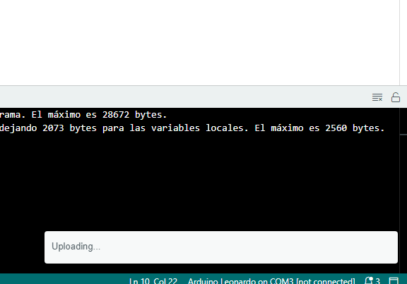

https://antoniovillena.com/product/espjoy/[ESPjoy] es un placa adaptadora con puertos https://es.wikipedia.org/wiki/D-sub[DE-9] para mandos https://es.wikipedia.org/wiki/Joystick_Atari[norma Atari] o https://es.wikipedia.org/wiki/Mega_Drive[Sega Mega Drive (Genesis)] y que convierte pulsaciones de sus botones a señales equivalentes de teclado.

Está diseñada originalmente para usarse con https://zxespectrum.speccy.org[ESPectrum], pero puede utilizarse con otros dispositivos, ya que es capaz de convertir, según se desee, a dos protocolos distintos de teclado (USB y PS/2), usando un interruptor incorporado.

Esta traducción a teclado es muy útil para emuladores o para aquellos dispositivos basados en FPGA, como la familia https://zxuno.speccy.org[ZX-Uno] y sus derivados o https://github.com/MiSTer-devel/Wiki_MiSTer/wiki[MiSTer], que no tengan soporte para conectores de joystick. Por ejemplo, para el uso en cores de ordenadores cuando no se desea un teclado conectado permanentemente.

El programa (firmware) grabado en la placa envía pulsaciones cuando se pulsa un botón de algún mando conectado y es capaz de utilizar dos mandos de manera simultánea.

Son compatibles los mandos y joystick de uno o dos botones (norma Atari), así como mandos Sega de tres o de 6 botones.

<<<

== Puertos y botones

[width="100%",cols="2a,3a",frame="none"]
|===
|[cols="1,4"]
!===
!1 !Primer Puerto DE-9
!2 !Segundo Puerto DE-9
!===
|image:img/ESPjoyFront.png[scaledwidth=70%]
|===

[width="100%",cols="3a,2a",frame="none"]
|===
| image:img/ESPjoyBack.png[scaledwidth=70%]
|[cols="1,4"]
!===
!3 !Puerto USB Mini-B
!4 !Interruptor de selección de protocolo
!===
|===

<<<

== Uso

=== Configuración

Para utilizarlo en ESPectrum se ha de seleccionar la opción PS/2 del interruptor. La opción USB se puede utilizar con MiSTer u otro sistema compatible (PC, Mac, etc.). Con el firmware original diseñado por David Carrión se emula un teclado HID, por lo que se puede usar sin problema en MiSTer con cores de ordenadores.

La detección de la conexión se realiza en los primeros segundos del arranque cuando la placa se conecta a un puerto USB o PS/2 y recibe alimentación. Si la placa está conectada a un dispositivo como un PC o similar durante el arranque del mismo, es muy probable que falle la detección USB, porque el sistema operativo no esté aún preparado cuando se alcanza el límite de tiempo de espera de detección de la placa. En ese caso, se ha de desconectar y volver a conectar una vez que el dispositivo esté preparado para detectar la conexión.

[TIP]
====
El interruptor de selección del modo PS/2 o USB se ha de cambiar siempre antes de conectar la placa a la alimentación, o no funcionará correctametne.
====

=== Selección del mapa de teclas

Durante el arranque, si se mantiene pulsado alguno de los botones especificados, según las tablas que hay a continuaciónm, se pueden seleccionar distintas traducciones de teclado .

[NOTE]
====
El comportamiento en la asignación por defecto (cuando no se pulsa ningún botón en el arranque) varía según el firmware que haya instalado en el ESPJoy. Cuando se indique la opción (Original) se estará hablando el firmware no adaptado para ESPectrum. En el otro caso (ESPectrum), se refiere al firmware adaptado para ESPectrum.
====

[WARNING]
====
La asignación por defecto del firmware de ESPectrum al usar el puerto PS/2 lo hace incompatible con otros dispositivos al usar una conexión PS/2. Por tanto, en ese caso, se ha de pulsar obligatoriamente un botón que active una configuración distinta de teclado durante el arranque.
====

[WARNING]
====
Existen algunos mandos clónicos que pueden enviar señales extrañas en algunas direcciones. Debido a esto, falla la comprobación en el código, y no funciona correctamente la activación en el arranque, por ejemplo, al pulsar izquierda en el mando. 
====

<<<

*Puerto 1 (PS/2)*

[align="center",width="100%",%header,cols="2a,1a,1a,1a,1a,1a,1a,1a,1a,1a,1a,1a,1a",options="header"]
|===
|[.tiny]#Pulsación Arranque#|[.tiny]#Arriba#|[.tiny]#Abajo#|[.tiny]#Izquierda#|[.tiny]#Derecha#|[.tiny]#A#|[.tiny]#B#|[.tiny]#C#|[.tiny]#Start#|[.tiny]#X#|[.tiny]#Y#|[.tiny]#Z#|[.tiny]#Mode#
|[.tiny]#Ninguna (Original)#|[.tiny]#Arriba#|[.tiny]#Abajo#|[.tiny]#Izquierda#|[.tiny]#Derecha#|[.tiny]#Escape#|[.tiny]#Enter#|[.tiny]#Alt Dcha.#|[.tiny]#F1#|[.tiny]#X#|[.tiny]#Y#|[.tiny]#Z#|[.tiny]#M#
|[.tiny]#Ninguna (ESPectrum)#|[.tiny]#Arriba#|[.tiny]#Abajo#|[.tiny]#Izquierda#|[.tiny]#Derecha#|[.tiny]#A#|[.tiny]#B#|[.tiny]#C#|[.tiny]#Start#|[.tiny]#X#|[.tiny]#Y#|[.tiny]#Z#|[.tiny]#Mode#
|[.tiny]#Arriba#|[.tiny]#Q#|[.tiny]#A#|[.tiny]#O#|[.tiny]#P#|[.tiny]#Escape#|[.tiny]#M#|[.tiny]#Enter#|[.tiny]#F1#|[.tiny]#X#|[.tiny]#Y#|[.tiny]#Z#|[.tiny]#C#
|[.tiny]#Abajo#|[.tiny]#Arriba#|[.tiny]#Abajo#|[.tiny]#Izquierda#|[.tiny]#Derecha#|[.tiny]#Escape#|[.tiny]#Enter#|[.tiny]#`0`#|[.tiny]#F5#|[.tiny]#X#|[.tiny]#Y#|[.tiny]#Z#|[.tiny]#M#
|[.tiny]#Izquierda#|[.tiny]#7#|[.tiny]#6#|[.tiny]#5#|[.tiny]#8#|[.tiny]#Escape#|[.tiny]#`0`#|[.tiny]#Enter#|[.tiny]#F1#|[.tiny]#X#|[.tiny]#Y#|[.tiny]#Z#|[.tiny]#M#
|===

*Puerto 2 (PS/2)*

[align="center",width="100%",%header,cols="2a,1a,1a,1a,1a,1a,1a,1a,1a,1a,1a,1a,1a",options="header"]
|===
|[.tiny]#Pulsación Arranque#|[.tiny]#Arriba#|[.tiny]#Abajo#|[.tiny]#Izquierda#|[.tiny]#Derecha#|[.tiny]#A#|[.tiny]#B#|[.tiny]#C#|[.tiny]#Start#|[.tiny]#X#|[.tiny]#Y#|[.tiny]#Z#|[.tiny]#Mode#
|[.tiny]#Ninguna (Original)#|[.tiny]#Q#|[.tiny]#A#|[.tiny]#O#|[.tiny]#P#|[.tiny]#Escape#|[.tiny]#M#|[.tiny]#Enter#|[.tiny]#F1#|[.tiny]#X#|[.tiny]#Y#|[.tiny]#Z#|[.tiny]#C#
|[.tiny]#Ninguna (ESPectrum)#|[.tiny]#Arriba#|[.tiny]#Abajo#|[.tiny]#Izquierda#|[.tiny]#Derecha#|[.tiny]#A#|[.tiny]#B#|[.tiny]#C#|[.tiny]#Start#|[.tiny]#X#|[.tiny]#Y#|[.tiny]#Z#|[.tiny]#Mode#
|[.tiny]#Arriba#|[.tiny]#Arriba#|[.tiny]#Abajo#|[.tiny]#Izquierda#|[.tiny]#Derecha#|[.tiny]#Escape#|[.tiny]#Enter#|[.tiny]#Alt Dcha.#|[.tiny]#F1#|[.tiny]#X#|[.tiny]#Y#|[.tiny]#Z#|[.tiny]#M#
|[.tiny]#Abajo#|[.tiny]#Arriba#|[.tiny]#Abajo#|[.tiny]#Izquierda#|[.tiny]#Derecha#|[.tiny]#Escape#|[.tiny]#Enter#|[.tiny]#`0`#|[.tiny]#F5#|[.tiny]#X#|[.tiny]#Y#|[.tiny]#Z#|[.tiny]#M#
|[.tiny]#Izquierda#|[.tiny]#7#|[.tiny]#6#|[.tiny]#5#|[.tiny]#8#|[.tiny]#Escape#|[.tiny]#`0`#|[.tiny]#Enter#|[.tiny]#F1#|[.tiny]#X#|[.tiny]#Y#|[.tiny]#Z#|[.tiny]#M#
|===

*Puerto 1 (USB)*

[align="center",width="100%",%header,cols="2a,1a,1a,1a,1a,1a,1a,1a,1a,1a,1a,1a,1a",options="header"]
|===
|[.tiny]#Pulsación Arranque#|[.tiny]#Arriba#|[.tiny]#Abajo#|[.tiny]#Izquierda#|[.tiny]#Derecha#|[.tiny]#A#|[.tiny]#B#|[.tiny]#C#|[.tiny]#Start#|[.tiny]#X#|[.tiny]#Y#|[.tiny]#Z#|[.tiny]#Mode#
|[.tiny]#Ninguna (Original)#|[.tiny]#Arriba#|[.tiny]#Abajo#|[.tiny]#Izquierda#|[.tiny]#Derecha#|[.tiny]#Escape#|[.tiny]#Enter#|[.tiny]#Alt Dcha.#|[.tiny]#F12#|[.tiny]#X#|[.tiny]#Y#|[.tiny]#Z#|[.tiny]#M#
|[.tiny]#Arriba#|[.tiny]#Q#|[.tiny]#A#|[.tiny]#O#|[.tiny]#P#|[.tiny]#Escape#|[.tiny]#M#|[.tiny]#Enter#|[.tiny]#F12#|[.tiny]#X#|[.tiny]#Y#|[.tiny]#Z#|[.tiny]#C#
|[.tiny]#Abajo#|[.tiny]#Arriba#|[.tiny]#Abajo#|[.tiny]#Izquierda#|[.tiny]#Derecha#|[.tiny]#Escape#|[.tiny]#Enter#|[.tiny]#`0`#|[.tiny]#F5#|[.tiny]#X#|[.tiny]#Y#|[.tiny]#Z#|[.tiny]#M#
|[.tiny]#Izquierda#|[.tiny]#7#|[.tiny]#6#|[.tiny]#5#|[.tiny]#8#|[.tiny]#Escape#|[.tiny]#`0`#|[.tiny]#Enter#|[.tiny]#F12#|[.tiny]#X#|[.tiny]#Y#|[.tiny]#Z#|[.tiny]#M#
|===

*Puerto 2 (USB)*

[align="center",width="100%",%header,cols="2a,1a,1a,1a,1a,1a,1a,1a,1a,1a,1a,1a,1a",options="header"]
|===
|[.tiny]#Pulsación Arranque#|[.tiny]#Arriba#|[.tiny]#Abajo#|[.tiny]#Izquierda#|[.tiny]#Derecha#|[.tiny]#A#|[.tiny]#B#|[.tiny]#C#|[.tiny]#Start#|[.tiny]#X#|[.tiny]#Y#|[.tiny]#Z#|[.tiny]#Mode#
|[.tiny]#Ninguna (Original)#|[.tiny]#Q#|[.tiny]#A#|[.tiny]#O#|[.tiny]#P#|[.tiny]#Escape#|[.tiny]#M#|[.tiny]#Enter#|[.tiny]#F12#|[.tiny]#X#|[.tiny]#Y#|[.tiny]#Z#|[.tiny]#C#
|[.tiny]#Arriba#|[.tiny]#Arriba#|[.tiny]#Abajo#|[.tiny]#Izquierda#|[.tiny]#Derecha#|[.tiny]#Escape#|[.tiny]#Enter#|[.tiny]#Alt Dcha.#|[.tiny]#F12#|[.tiny]#X#|[.tiny]#Y#|[.tiny]#Z#|[.tiny]#M#
|[.tiny]#Abajo#|[.tiny]#Arriba#|[.tiny]#Abajo#|[.tiny]#Izquierda#|[.tiny]#Derecha#|[.tiny]#Escape#|[.tiny]#Enter#|[.tiny]#`0`#|[.tiny]#F5#|[.tiny]#X#|[.tiny]#Y#|[.tiny]#Z#|[.tiny]#M#
|[.tiny]#Izquierda#|[.tiny]#7#|[.tiny]#6#|[.tiny]#5#|[.tiny]#8#|[.tiny]#Escape#|[.tiny]#`0`#|[.tiny]#Enter#|[.tiny]#F12#|[.tiny]#X#|[.tiny]#Y#|[.tiny]#Z#|[.tiny]#M#
|===

<<<

== Actualización de firmware

Existen diferentes versiones de firmware (el programa grabado en la memoria flash de la placa y que se encarga de realizar la traducción a pulsaciones de teclado):

- El firmware original, que puede utilizarse para enviar pulsaciones de teclado PS/2 o USB y que está disponible aquí:

http://github.com/Dacarsoft/DB9_2_Keyboard

- La variante específica para https://zxespectrum.speccy.org[ESPectrum], y que envía, por defecto, para PS/2, unas pulsaciones especiales para el emulador, disponible aquí:

https://github.com/dacarsoft/DB9_2_Keyboard/tree/DB9_2_Keyboard_ESPectrum

- También se puede instalar el firmware Daemonbite disponible en esta ubicación:

https://github.com/MickGyver/DaemonBite-Retro-Controllers-USB/tree/master/SegaTwoControllersUSB

[NOTE]
====
En este último caso, el ESPJoy funcionará como mando de juegos HID USB, pero perdiendo el soporte de protocolo PS/2.
====

Para actualizar la programación de la placa, existen varias opciones de software, aunque todas requieren un ordenador o similar con puertos USB y un sistema operativo Windows, Linux o macOS.

La forma de programar dependerá del formato en que se encuentre disponible el programa.

<<<

=== Firmware como código fuente (formato INO)

En este caso, el firmware no está completamente listo para ser instalado en la placa y tiene que ser compilado desde su código fuente antes ser grabado en la memoria flash de la placa. El mejor sistema en este caso, consiste en utilizar el entorno de desarrollo oficial de https://www.arduino.cc[Arduino].

==== Arduino IDE

Para poder hacer este tipo de instalación, se puede usar un ordenador (Windows, Mac, Linux) con el entorno https://www.arduino.cc/en/software[Arduino IDE] instalado.

===== Actualización

Una vez preparado el entorno con Arduino IDE instalado, descargar la versión deseada del proyecto desde el repositorio correspondiente (estándar, ESPectrum, etc.). Normalmente es una carpeta con varios ficheros, uno de los cuales tiene la extensión `.ino` en el nombre.

Abrir el fichero del proyecto en Arduino IDE (por ejemplo `DB9_2_Keyboard_ESPectrum.ino`).

Colocar el interruptor de la placa en la posición marcada como "USB" (la posición más cercana al conector USB Mini-B). Conectar el ESPjoy al equipo usando el cable USB y seleccionarlo en la parte superior de la ventana del IDE (opción "Arduino Leonardo").

[.text-center]
image:img/ideleonardo.png[scaledwidth=40%]

<<<

Finalmente, pulsar el botón de carga del firmware (upload)  y esperar unos segundos mientras se compila el proyecto y se carga en el dispositivo.

[.text-center]
image:img/ideupload.png[scaledwidth=40%]          

<<<

=== Firmware en formato HEX

En este otro caso, el firmware está completamente listo para ser grabado en la memoria flash de la placa. Existen múltiples programas que se pueden utilizar para hacer la grabación.

==== AVRDUDE

AVR Downloader Uploader es un programa de línea de comandos que sirve para manipular los contenidos ROM y EEPROM de múltiples microcontroladores.

Para poder utilizarlo con ESPJoy, se necesita una versión reciente que soporte el parámetro `-r` (reconnect to -P port after "touching" it). Véanse las <<#_sobre_la_programación_de_arduino_leonardo,notas Técnicas>> al final de este manual para más información.

La última versión ejecutable para Windows se puede descargar desde el repositorio oficial:

https://github.com/avrdudes/avrdude

Para otros sistemas, es bastante sencillo compilar el ejecutable desde el código fuente disponible en dicho repositorio. También está disponible en múltiples sistemas de instalación de paquetes, como https://brew.sh/[Homebrew para Mac], o los distintos repositorios oficiales de distribuciones de Linux. 

===== Actualización

Tras obtener la versión de firmware deseada del fichero `.hex` (por ejemplo `DB9_2_Keyboard.ino.hex`), colocar el interruptor de la placa en la posición marcada como "USB" (la posición más cercana al conector USB Mini-B). A continuación conectar la placa ESPJoy al ordenador a un puerto USB, e identificar dicho puerto en el sistema operativo.

<<<

Una vez identificado el nombre del puerto, se puede grabar el fichero en la placa con un comando como el siguiente:

[source,shell]
----
.../avrdude -F -patmega32u4 -cavr109 -b57600 -r -P <puerto> -U flash:w:<fichero.hex>:i
----

Donde `<puerto>` es la identificación del puerto donde está conectada la placa y `<fichero.hex>` es la ruta al fichero `.hex` que se desea grabar.

Por ejemplo, para un puerto llamado `/dev/cu.usbmodemHIDPC1` y un fichero `DB9_2_Keyboard.ino.hex`:

[source,shell]
----
.../avrdude -F -patmega32u4 -cavr109 -b57600 -r -P /dev/cu.usbmodemHIDPC1 -U flash:w:DB9_2_Keyboard.ino.hex:i
----

Esperar unos segundos, y, si todo va bien, en la consola aparecerán mensajes indicando que se ha grabado el programa correctamente.

[.text-center]
image:img/avrdudeupload.png[scaledwidth=60%]

<<<

== Notas Técnicas

=== Sobre la programación de Arduino Leonardo

La placa ESPJoy está basada en un controlador programable https://www.microchip.com/en-us/product/ATmega32U4[ATmega32u4], que es el mismo que utilizan las placas https://docs.arduino.cc/hardware/leonardo/[Arduino Leonardo].

Estos dispositivos disponen de un cargador de arranque que se puede utilizar para la programación de la flash, pero también puede omitirse para ejecutar directamente la programación guardada. Así es como se determina cuál de las dos posibilidades es la que se activa:

- Si se inicia después de una orden de reinicio (es decir, se ha pulsado el botón de reinicio cuando la placa dispone del mismo), siempre se activa el modo de programación (grabación de programa en la memoria flash).
- Si no hay programa almacenado en la flash (la primera palabra es `0xffff`), siempre se activa el modo de programación.
- Si arranca después de un encendido en frío (lo que significa que el dispositivo se activa por primera vez después de aplicar alimentación), intentará ejecutar el programa almacenado.
- Si arranca después de un reinicio (reset) por watchdog (perro guardián), entonces:
  * Si hay el código adecuado escrito en una ubicación mágica en la SRAM (`0x7777` escrito en `0x0800`), entonces pasará al modo de programación.
  * Si no, intentará ejecutar el código de usuario.
- Si arranca después de cualquier otro tipo de reinicio, pasará a modo programación.

El gestor de arranque esta hecho de forma que detecta si se ha abierto y cerrado una conexión serie a 1200 baud al puerto, y, en ese caso, realiza los pasos necesarios para hacer un reinicio por watchdog.

Finalmente, señalar que el gestor de arranque tiene un tiempo de espera de 8 segundos. Si la programación no se ha iniciado en ese tiempo después de activar (a través de cualquier método) en el modo de programación, intentará de nuevo ejecutar el código de usuario.

Como consecuencia de esto, la programación por vía de comandos, etc. en Windows requiere que estén instalados los controladores específicos para los dos modos (ejecución de programa y programación) para todos los puertos serie (COM), para que la nueva conexión tras el reinicio por watchdog funcione correctamente.

En el caso de la grabación con <<#_avrdude,AVRDUDE>>, es muy recomendable usar una versión que disponga del parámetro `-r`, y que por tanto realiza automáticamente este proceso de apertura y cierre de conexión, y conexión posterior, dentro de los 8 segundos de margen necesarios para la programación. En otro caso puede ser algo complicado realizarlo de forma manual.
