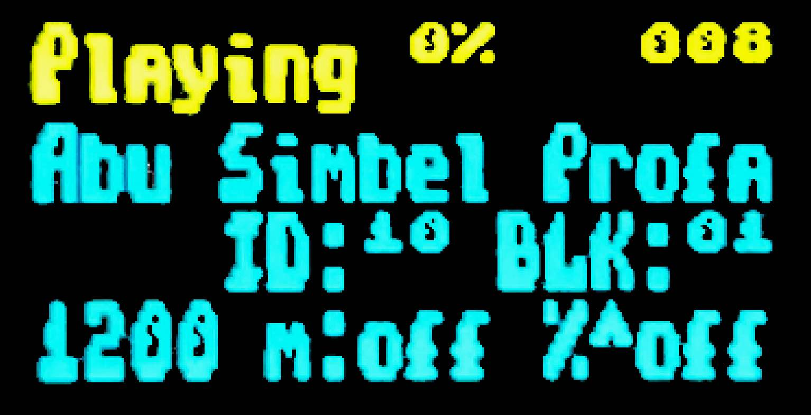
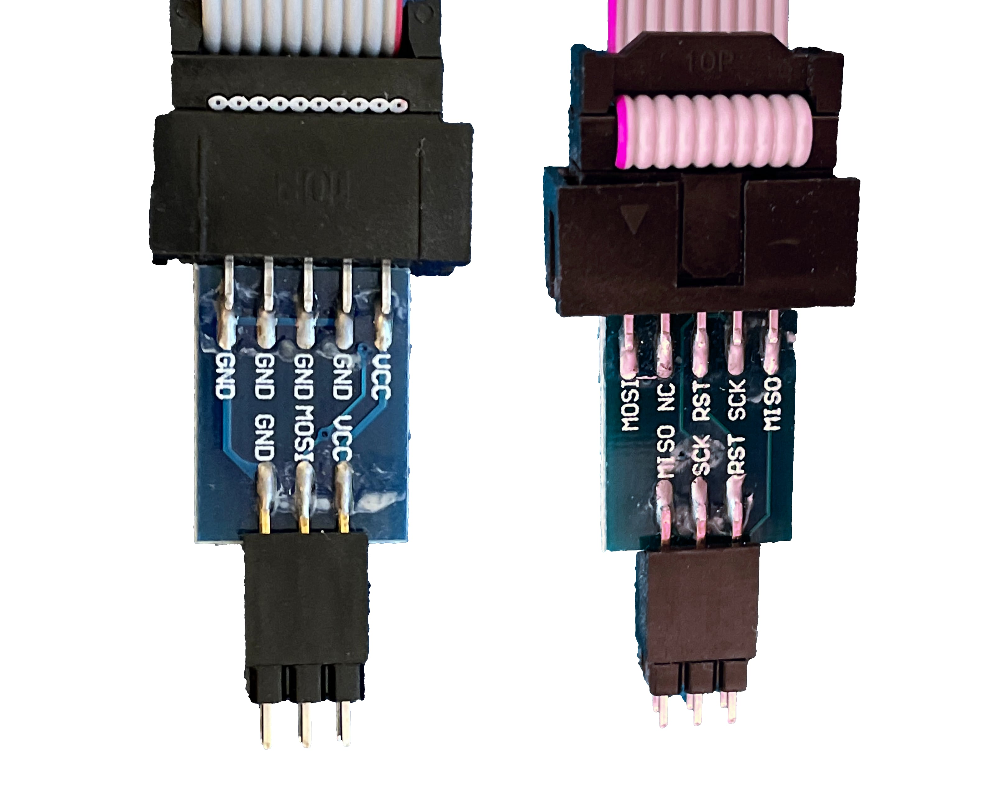
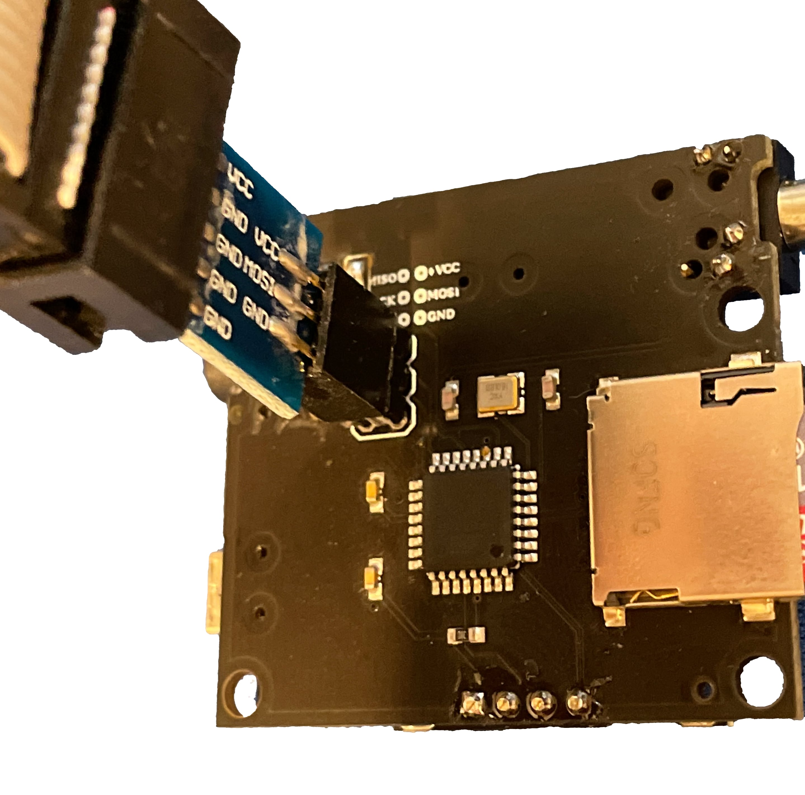

https://www.antoniovillena.es/store/product/miniduino/[Miniduino] is a tape file audio player, based on an STM32F103C8T6 microcontroller or ATMega38P with the https://github.com/rcmolina/MaxDuino_BETA[Maxduino] firmware preinstalled.

Maxduino works in a similar way to https://es.wikipedia.org/wiki/Casete[cassette tape] players, using digital tape files formats such as `TAP` and `TZX` (ZX Spectrum), `O` (ZX80), `P` (ZX81), `CDT` (Amstrad CPC), `CAS`(MSX) `TSX` (MSX, Acorn, etc). It's also possible to play AY music files as if they were tapes, to load them from http://www.specay.co.uk[SpecAY] in a ZX Spectrum.

== Ports and buttons

[.text-center]
image:img/MiniduinoBack.jpg[scaledwidth=50%]

[.text-center]
image:img/MiniduinoFront.jpg[scaledwidth=50%]

[cols=2*]
|===
|1
|Power
|2
|Audio output
|3
|Control button
|4
|Motor control
|5
|SD card slot
|6
|Screen
|===

<<<

== Configuration

An SD card is required to store the tape files to play. Fast cards (Class 10 or greater) aren't recommended because there can be problems while reading the data. High capacity (SDXC or greater) cards aren't recommended either.

The SD card must have the first partition formatted as FAT16 or FAT32.

Besides the card, you must connect an appropriate audio cable to <<#_ports_and_connectors,audio input>>. It must have a 3.5mm stereo jack on one side, and two mono output on the other side (one for each audio channel). The right audio mono is connected to the Miniduino.

If you have a device that can use motor control, you can also use a cable with a 2.6mm jack.

Copy the tape files (`TAP`, `TZX`, `O`, `P`, `CAS`, `TSX` and so on) to the first partition of the SD card. They can be organised using folders or directories.

[TIP]
====
The player shows file and folder entries in the order stored in the internal FAT table, not alphabetically. If you want to see them ordered you must reorder the SD card structure with a utility such as https://fatsort.sourceforge.io/[FATsort], https://www.luisrios.eti.br/public/en_us/projects/yafs/[YAFS], http://www.trustfm.net/software/utilities/SDSorter.phpp[SDSorter] or another application.
====

<<<

== Use

After the SD card with the data files is inserted, power it on by connecting the included USB power cable.

[.text-center]
image:img/MiniduinoLogo.jpg[scaledwidth=30%]

To show the optional menu, hold down the control button:

- Baud Rate: Configures turbo speed baud rates when playing 4B blocks in MSX files (`CAS` and `TSX`).
- Motor Ctrl: Enable this option when a control cable is connected to a proper device (Amstrad, CPC, MSX and so on).
- Converter (TSXCzxpUEFWS): Enables turbo loading `CAS` and `TSX` files, changes signal for Spectrum and Amstrad CPC files or change parity when playing Acorn Electron and BBC Micro `UEF` files.
- (Skip BLK)): To switch off (Skip ON) or enable an automatic pause when 2A blocks are found.

Outside the options menu, the control button is used as a four directional control joystick that has two different behaviours depending on whether the player is stopped or paused.

[.text-center]
image:img/MiniduinoVersion.jpg[scaledwidth=30%]

When the player is stopped (file and directories browser):

- Up and Down move through the current files and folders list.
- Left (Stop) goes one level up in the folder tree.
- Right (Play/Pause) enters a folder or, if the selection is a file, tries to play it.

<<<

When a file is playing you can stop it with the left button (Stop) or pause using the right button (Play/Pause).

[.text-center]

When in pause (tape block browser:

- Up and Down move through the tape block files already played (useful for multiload titles or to load a previous level block).
- Left (Stop) cancels the player and goes back to file and folder browser mode.
- Right (Play/Pause) continues playing from the selected block.
- Press down the control button to enable or disable turbo mode for MSX.

== Making TZX or TSX files from other formats

While some tape file formats (Commodore, Camputers Lynx and so on) are not supported by Maxduino, there are some utilities that can, more or less successfully, embed <<#_audio_file_conversion,audio data>> in a `TSX` or `TZX` file, which then can be used with Miniduino.

=== MakeTSX

You can use this command with NataliaPC's https://github.com/nataliapc/makeTSX/releases[MakeTSX] to create a `TSX` file with embedded audio:

[source,shell]
----
...MakeTSX -b15 -wav audio_file.wav -tsx new_file.tsx
----

=== RetroConverter

Jorge Fuertes' https://github.com/jorgefuertes/retroconverter/releases[RetroConverter] can create a `TZX` file:

[source,shell]
----
...retroconv audio_file.wav new_file.tzx
----

<<<

== Maxduino firmware upgrade

The Maxduino firmware is periodically updated and improved. You can track the changes and improvements either at the  https://www.va-de-retro.com/foros/viewtopic.php?t=5541&start=9999[Va de Retro forums] or at the https://github.com/rcmolina/MaxDuino_BETA[GitHub project page]. To take advantage of this improvements, the Miniduino flash image must be flashed with the updated firmware version.

There are two Miniduino models; one based on the STM32 microcontroller and the ther on the ATMega328P.

<<<

=== STM32 Model

==== Environment setup

Firmware flashing is done from a computer (Windows, macOS or Linux) with https://www.arduino.cc/en/software[Arduino IDE] installed.

You must install SDFat (1.1.4) software library selecting the menu option Program -> include library -> manage libraries.

Minidiuno microcontroller support must also be added. This is done in two steps:

. Add ARM Cortex M3 support from menu Tools -> board -> board manager, and installing "Arduino SAM boards (Cortex-M3)".
. Add STM32 microcontroller support; download the file available at https://github.com/rogerclarkmelbourne/Arduino_STM32/archive/master.zip[this link].

Extract the contents to the current user folder in:

[source,shell]
----
...Arduino/hardware/Arduino_STM32
----

On Windows, install the USB device controller running (with elevated privileges:

[source,shell]
----
 ...\drivers\win\install_drivers.bat
----

On Linux, install with root privileges the necessary `udev` rules:

[source,shell]
----
...tools/linux/install.sh
----

On macOS, if Miniduino doesn't appear as a USB device in Arduino ID when connected it may be necessary to install https://github.com/libusb/libusb/wiki[libusb].

<<<

Last, on Mac or Linux, the file `maple_upload` inside `Arduino_STM32` must be edited with a text editor. Those lines do not work:

[source,shell]
----
if [ $# -eq 5 ]; then
    dfuse_addr="--dfuse-address $5"
else
    dfuse_addr=""
fi
----

They must be changed to:

[source,shell]
----
dfuse_addr=""
----

<<<

==== Upgrade

After the environment is ready, download the software from the https://github.com/rcmolina/MaxDuino_BETA[official repository in GitHub].

[NOTE]
====
The Miniduino player with STM32 microcontroller is only supported from version 1.65 and up.
====

Load the project file with Arduino IDE (for example `MaxDuino_v1.69.ino`).

Ensure that all logo entries in `userSTM32Config.h` file are commented out except for Miniduino.

[source,c]
----
...
//#define tanque4
//#define tanque1
//#define dostanques
//#define cablemax
//#define sony
#define miniduino
...
----

Connect the Miniduino device to the computer using the USB cable, and find the assigned port, typically called something like "Maple Mini" (for example: COM5 Maple Mini)

Fom the "Tools" menu set these options:

[source]
----
Board: Generic STM32F103C Series.
Variant: STM32F103C8 (20k RAM, 64k Flash).
Upload Method: STM32duino bootloader.
CPU Speed: 72Mhz (Normal).
Optimize: Smallest (default).
Port: <Previously identified port>.
----

Last, click on the firmware load button and wait for a few seconds while the project is compiled and loaded into the device.

If everything has been done correctly the Miniduino will restart and show on the screen the new firmware version.

<<<

=== ATMega328P Model

==== Environment setup

*Requirements*:

- One https://en.wikipedia.org/wiki/Hex_key[hex key] with the right socket size for the cover screws
- USBasp flash programmer

[.text-center]

Also, firmware flashing is done from a computer (Windows, Mac, Linux) with https://www.arduino.cc/en/software[Arduino IDE] installed.

You must install SDFat (1.1.4) software library selecting the menu option Program -> include library -> manage libraries.

==== Upgrade

After you have the environment ready, download the software from the https://github.com/rcmolina/MaxDuino_BETA[official repository in GitHub]

Load the project file with Arduino IDE (for example `MaxDuino_v1.69.ino`).

Check in the file `userconfig.h` that all logo entries are commented except for Miniduino and, if not, change them.

[source,c]
----
...
//#define tanque4
//#define tanque1
//#define dostanques
//#define cablemax
//#define sony
#define miniduino
...
----

<<<

Connect the Miniduino device to the USBasp programmer, making sure that the connector is in the right position (i.e VCC with VCC, MOSI with MOSI, GND witch GND, etc.), and connect the USB adapter to the computer

[.text-center]

Set the following options in the "Tools" menu:

[source]
----
Board: Arduino Pro or Pro Mini
Processor: ATmega328P (5V,16 Mhz)

Programmer: "USBasp"
----

Last, hold down the 'Shift' key on the computer while clicking the firmware load button. Wait for a few seconds until the project is compiled and loaded into the device.

If everything was done correctly the Miniduino will restart and show on the screen the new firmware version.
